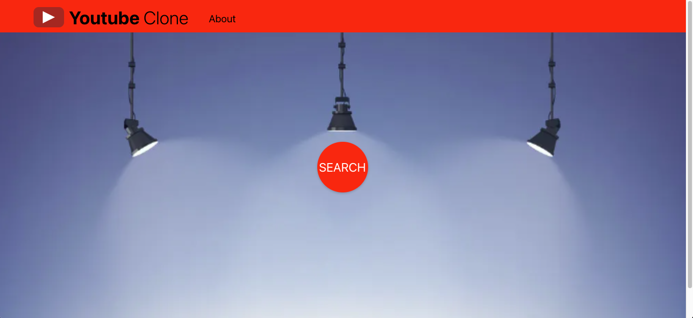
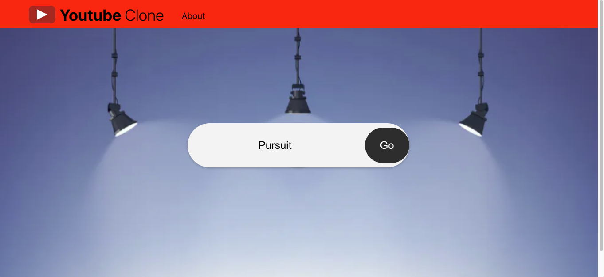
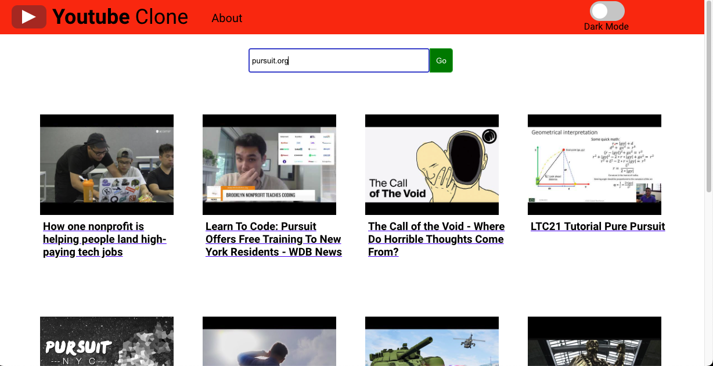
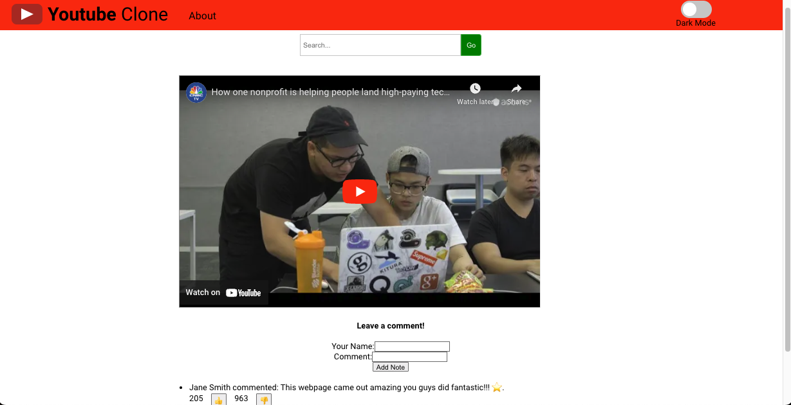

# **About Our Project** 

<a href="https://beautiful-selkie.netlify.app" target="_blank">Click here - YouTube Clone</a>

Our project is a video search and viewing app, YouTube clone, that allows users to search for videos and play them within the app. The app has a simple and intuitive user interface, which includes a search bar on the home page that allows users to get a list of videos based on their search criteria. Users can click on a video thumbnail to play the video they are interested in and share the link to the individual video with others.

The app also includes an "About" page where users can learn about the project and its developers. This page contains a brief project description, as well as a short bio for each teammate and links to their GitHub accounts. The "About" page can be accessed through the navigation bar that appears on every page of the app.

In order to ensure a seamless user experience, we have also implemented a modal window that displays when a 400 error occurs. This modal allows users to try their search again and exit the message by clicking an x or outside the modal.

Our app is built using JSX to create components, and we have committed to using hooks. We have used create-react-app to build the app and fetch to make API calls. React-router-dom is used to create different views, while youtube-react is used to create a Youtube component for viewing videos from the Youtube API. State is used to build a stateful React application, and CSS is used to make a responsive and attractive app with decent interface.
  

## App Screenshots

<!--  -->
### The Home Screen

|  |
|-|

<!--  -->

### The Expanding  Search Bar

|  |
|-|

<!--  -->

### Search Results Page

|  |
|-|

### Video Play Page

|  |
|-|

<!-- 

 -->

  
## 😁 Meet the Team 😁

### Jose Cepeda

I'm currently a Full Stack Web Development Fellow at Pursuit, a 12-month, Google-funded software engineering fellowship with a 9% acceptance rate whose graduates have been hired as developers at leading companies such as Pinterest, JP Morgan, Citi, Spotify, and Blackstone. I'm currently learning React, having already studied JavaScript, HTML & CSS and I am training to become a software engineer so that I can solve real-world problems.

<!-- [GitHub](https://github.com/jose-cepeda){:target="_blank rel="noopener"} -->
<a href="http://github.com/JoseC620" target="_blank">GitHub</a>
  

### Mark Roberston

I'm currently a Full Stack Web Development Fellow at Pursuit, a 12-month, Google-funded software engineering fellowship with a 9% acceptance rate whose graduates have been hired as developers at leading companies such as Pinterest, JP Morgan, Citi, Spotify, and Blackstone. I'm currently learning React, having already studied JavaScript, HTML & CSS and I am training to become a software engineer so that I can solve real-world problems. When I'm not coding, I enjoy movies, watching Formula 1 racing, music, travel and playing with my German Shepherd. Being a Pursuit Fellow will give me the foundation to go on and learn new and exciting languages such as Python, C++, C# et al. that I would like to use both personally and professionally. My first personal project will be to design and implement a quantitative trading algorithm that I can run through an API to a trading platform. I would very much enjoy working for a start-up (as I have start-up experience) or even a large financial firm, as my experience up until Pursuit has been in the financial markets.

<!-- [GitHub](https://github.com/mark-robertson){:target="_blank"} -->
<!-- https://beautiful-selkie.netlify.app/ -->

<a href="https://beautiful-selkie.netlify.app" target="_blank">YouTube Clone</a>

<a href="https://github.com/MarkRobertson67" target="_blank">GitHub</a>

<!-- [Trello Board link](https://trello.com/b/R929oK85/untitled-board){:target="_blank"} -->

